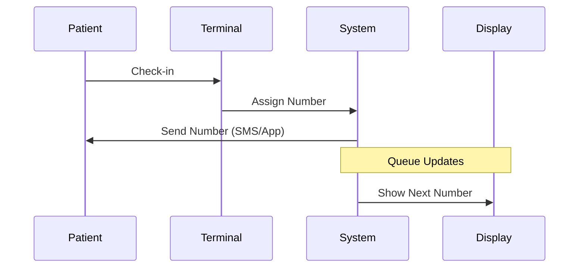

## Overview

wartennmitadana provides essential tools for efficient patient management in doctor's offices, MVZ, and hospitals. You can handle queues discreetly without announcing names, using reusable cards, digital notifications, or displays. Key capabilities include intuitive queue management, automated notifications, cross-device access, and seamless integrations.

<Columns cols={2}>
  <Card title="Drag-and-Drop Queue" icon="move" href="#drag-and-drop">
    Rearrange patients effortlessly with visual drag-and-drop interface.
  </Card>
  <Card title="Room Notifications" icon="bell" href="#notifications">
    Get alerts for room availability with auto-calls to patients.
  </Card>
  <Card title="Multi-Device Support" icon="smartphone" href="#devices">
    Access from PCs, tablets, or smartphones anywhere.
  </Card>
  <Card title="Self-Check-In Integration" icon="terminal" href="#integrations">
    Connect terminals and TV displays for complete workflow.
  </Card>
</Columns>

## Drag-and-Drop Patient Queue Management

Manage your waiting room queue visually. Assign 3-digit numbers to patients via cards, printouts, SMS, or app. Drag patients between queues, prioritize urgent cases, or move them to rooms directly from the dashboard.

<Steps>
  <Step title="Assign Number" icon="user-plus">
    Register patient and issue number via card or digital method.
  </Step>
  <Step title="Build Queue" icon="list">
    Drag new arrivals into the main waiting queue.
  </Step>
  <Step title="Prioritize" icon="arrow-up">
    Drag urgent patients to the top or to exam rooms.
  </Step>
  <Step title="Call Patient" icon="volume">
    Select and call by number; system announces discreetly.
  </Step>
</Steps>

<Callout kind="tip">
  Use color-coded queues for different services like general checkups or specialists.
</Callout>

## Room Availability Notifications and Auto-Calls

Stay informed when rooms free up. Configure auto-calls that notify the next patient via display, SMS, or app push. Set rules for delays or no-shows.

```javascript
// Example configuration for auto-calls
const autoCallConfig = {
  enabled: true,
  delayMinutes: 2,
  channels: ["display", "sms"],
  roomId: "exam-1"
};
```

<Expandable title="Advanced Notification Rules" default-open="false">

Define custom logic:

````javascript
if (patient.waitTime > 15 && room.available) {
  notifyPatient(patient.number, "room-ready");
}
````

</Expandable>

## Multi-Device Support

Access the system seamlessly across devices. Responsive design ensures smooth operation on any screen size.

<Tabs>
  <Tab title="PC" icon="monitor">
    Full dashboard for queue management and analytics.
    
    ```javascript
    // Login on desktop
    const dashboard = await loadDashboard("https://app.wartenmitadana.de");
    ```
  </Tab>
  <Tab title="Tablet" icon="tablet">
    Portable control for reception staff.
    
    ```javascript
    // Tablet queue view
    refreshQueue();
    ```
  </Tab>
  <Tab title="Smartphone" icon="smartphone">
    Quick checks and calls on the go.
    
    ```javascript
    // Mobile API call
    callPatient(123);
    ```
  </Tab>
</Tabs>

## Integrations with Terminals and Displays

Connect self-check-in terminals for touchless registration and large TV displays for waiting room announcements. Patients scan QR codes or use kiosks to get numbers automatically.



<Callout kind="info">
  All integrations use secure `https://api.wartenmitadana.de` endpoints. Test in sandbox first.
</Callout>

<Columns cols={2}>
  <Card title="Next: Quickstart" icon="book-open" href="/quickstart">
    Set up your first queue in minutes.
  </Card>
  <Card title="API Reference" icon="code" href="/authentication">
    Integrate programmatically.
  </Card>
</Columns>