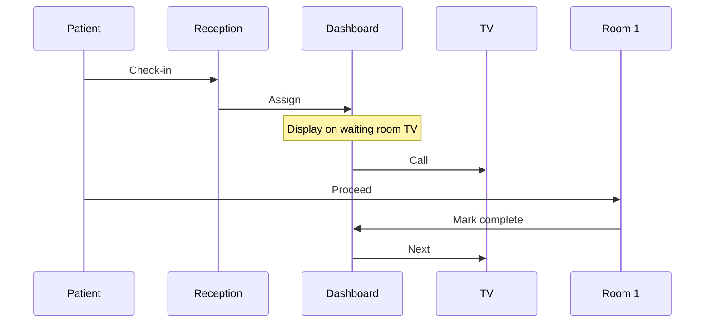

## Prerequisites

Before you begin, ensure you have the following:

<Callout kind="info">

- A modern web browser like Chrome, Firefox, or Safari
- An active internet connection
- Access to your practice's email for account verification
- A device for managing the queue, such as a tablet or computer

</Callout>

## Create Your Account and Log In

Sign up for wartenmitadana in under 2 minutes to start managing your waiting room discreetly.

<Steps>
  <Step title="Sign Up" icon="user-plus">
    Visit [https://wartenmitadana.de/register](https://wartenmitadana.de/register) and complete the registration form with your practice details.

    Provide your practice name, email, and phone number. Accept the terms and submit.
  </Step>

  <Step title="Verify Email" icon="mail">
    Check your inbox for the verification email from wartenmitadana.

    Click the verification link to activate your account.
  </Step>

  <Step title="Log In" icon="log-in">
    Go to [https://wartenmitadana.de/login](https://wartenmitadana.de/login).

    Enter your email and password to access the dashboard at `https://app.wartenmitadana.de`.
  </Step>
</Steps>

## Assign Patient Numbers

Assign anonymous numbers to patients using physical cards, printouts, or digital methods. This keeps calls discreet without naming patients.

<Tabs>
  <Tab title="Physical Cards" icon="card">
    Use reusable, disinfectable wartenmitadana cards.

    <Steps>
      <Step title="Generate Numbers">
        In the dashboard, navigate to `Queue Management > Assign Numbers`.
      </Step>
      <Step title="Print or Hand Out">
        Select `Physical Card` mode and dispense the next available 3-digit number (e.g., `101`).
      </Step>
    </Steps>
  </Tab>

  <Tab title="Digital/SMS" icon="smartphone">
    Send numbers via SMS or display on patient devices.

````jsx
// Example SMS configuration in dashboard
Number: 102
SMS Template: "Your turn at wartenmitadana: 102. Thank you!"
````

    Enable `SMS Notifications` in settings and enter your SMS gateway credentials.
  </Tab>
</Tabs>

## Configure Basic Queue and Room Settings

Set up your rooms and queue rules for efficient patient flow.

<Columns cols={2}>
  <Card title="Add Rooms" icon="building" href="/configuration">
    Define treatment rooms like `Room 1`, `Room 2`. Set capacities and call priorities.
  </Card>

  <Card title="Queue Rules" icon="settings" href="/configuration">
    Configure auto-advance, hold times, and recall options for smooth operations.
  </Card>
</Columns>

## Run Your First Patient Call Sequence

Test the full workflow with a simulated sequence.



<Steps>
  <Step title="Simulate Queue" icon="play">
    In `Queue Management`, add test patients: `#101` to `Room 1`, `#102` waiting.
  </Step>

  <Step title="Trigger Call" icon="volume-2">
    Click `Call Next`. The waiting room display shows: "Please proceed to Room 1: 101".
  </Step>

  <Step title="Complete and Advance" icon="check-circle">
    Mark `#101` as attended. Automatically advance to `#102`.
  </Step>
</Steps>

<Callout kind="success">
  Congratulations! You've completed your first patient call. Your waiting room is now paperless and name-free.
</Callout>

## Next Steps

Explore more features to optimize your practice.

<Columns cols={3}>
  <Card title="Advanced Configuration" icon="settings" href="/configuration">
    Customize displays, SMS, and integrations.
  </Card>

  <Card title="Self-Check-In Terminal" icon="tablet" href="/guides">
    Set up automated patient registration.
  </Card>

  <Card title="Waiting Room TV Setup" icon="tv" href="/guides">
    Connect displays for visual announcements.
  </Card>
</Columns>

<Expandable title="Troubleshooting Common Issues" default-open="false">

- **Display not updating?** Ensure your TV is connected to the dashboard via browser.
- **SMS failing?** Check your gateway credentials in `Settings > Notifications`.
- **Numbers skipping?** Verify queue rules don't have overlaps.

</Expandable>